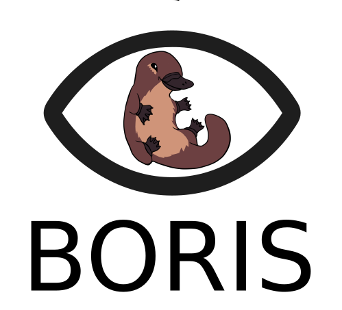

********************
BORIS App user guide
********************

**version 0.1**

BORIS web site: `www.boris.unito.it <http://www.boris.unito.it>`_

BORIS user guide: `boris.readthedocs.io <http://boris.readthedocs.io>`_

Legal
=====

Copyright 2017 Olivier Friard - Marco Gamba

**BORIS App** is free software; you can redistribute it and/or modify
it under the terms of the GNU General Public License as published by
the Free Software Foundation; either version 2, or any later version.

**BORIS App** is distributed in the hope that it will be useful,
but WITHOUT ANY WARRANTY; without even the implied warranty of
MERCHANTABILITY or FITNESS FOR A PARTICULAR PURPOSE.  See the
`GNU General Public License <http://www.gnu.org/copyleft/gpl.html>`_ for more details.

Introduction
============

**BORIS App** lets the user code for live observations.

**BORIS App** is designed to be used with **BORIS** (Behavioral Observation Research Interactive Software).

**BORIS App** run on Android. You will have to install before the `Kivy Launcher <https://play.google.com/store/apps/details?id=org.kivy.pygame&hl=en>`_

Installation
============

1) Install the Kivy Launcher

BORIS App is developped in Python using `Kivy <https://kivy.org>`_ as user interface.
You must install the Kivy Launcher on your Android device before installing BORIS App.

https://play.google.com/store/apps/details?id=org.kivy.pygame&hl=en

You can run Kivy applications on Android, on any device with Android 2.2 +.

2) Install BORIS App on your Android device

Extract the ZIP archive on your computer and the extracted directory (boris_app) to /sdcard/kivy/.

/sdcard/kivy/boris_app

Use
===

1) Launch the BORIS App

* Start **Kivy Launcher** 

* Select BORIS App, you should see the following screen:

.. image:: home.png
   :scale: 100%

* Click on **Download project** button

.. image:: download_screen.png
   :scale: 100%

2) Transfer your project from BORIS Desktop to BORIS App user guide

* Launch **BORIS Desktop**

* Open the project containing the ethogram

* Start the project server (File > Project server)

* Launch BORIS App user guide

* Select "Download project"

* Check the "Download from BORIS" (default)

* Input the URL shown in BORIS Desktop (for example 192.168.1.2:1234)

* Click Download

You should receive the project from BORIS Desktop

3) Open the project and start a new observation

* Select "Open project"

* Select the project

* Click "Open project"

4) Start a new observation

*

