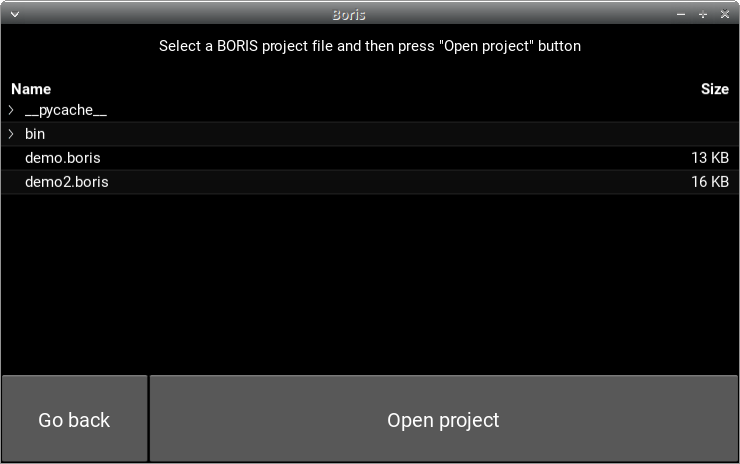
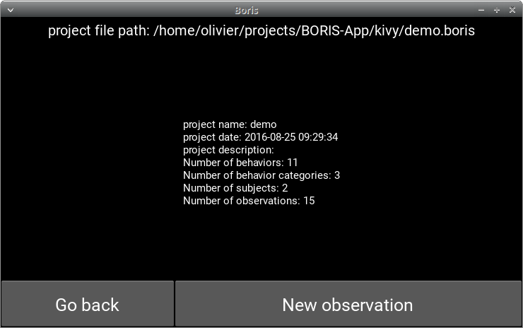
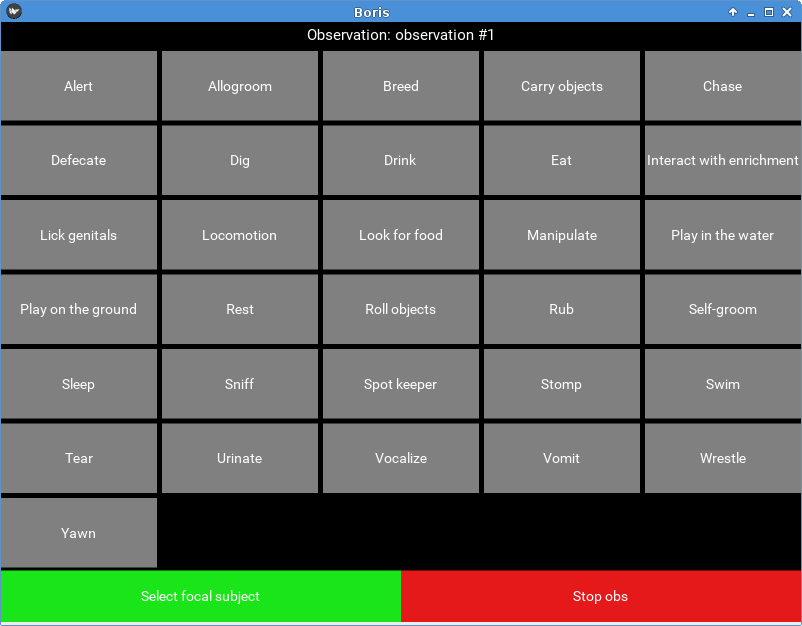
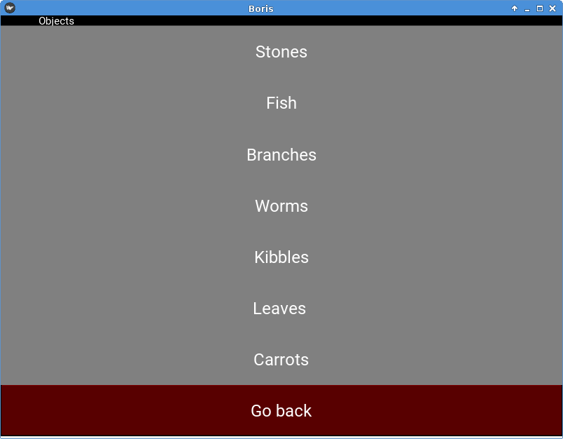
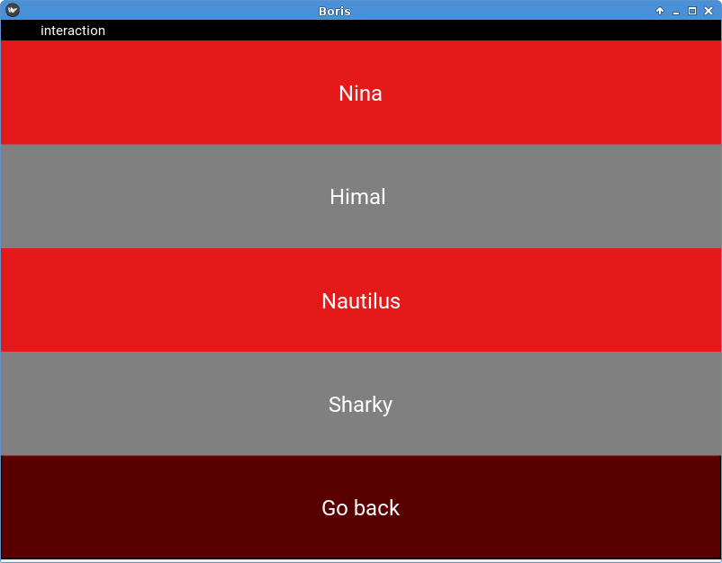
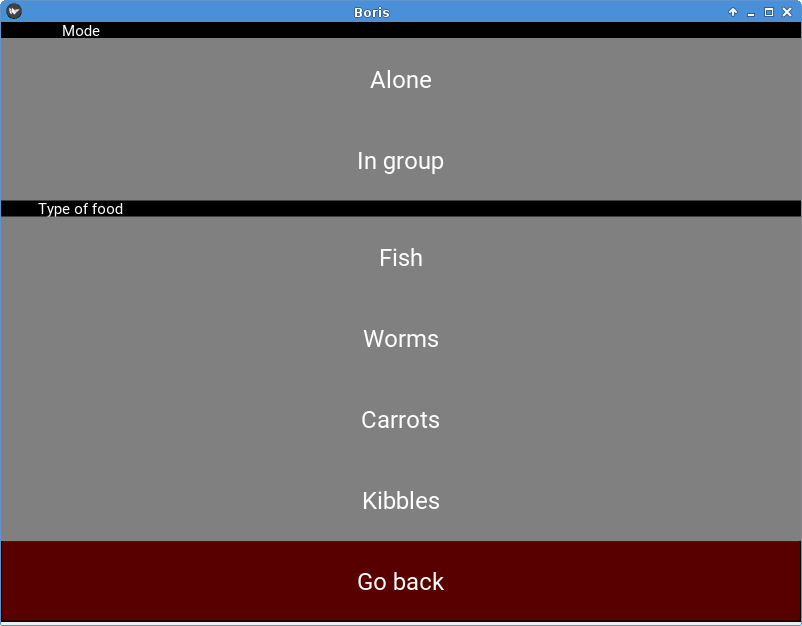
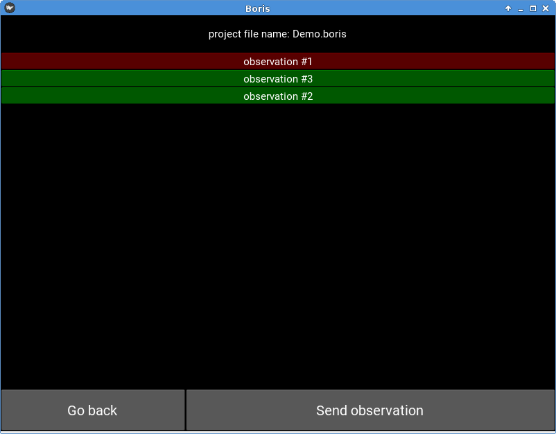

==========================================
BORIS App user guide
==========================================

:Author: `Olivier Friard <http://www.di.unito.it/~friard>`_

.. image:: logo_boris_500px.png
   :scale: 300%

**version 0.4**

**Be careful! This version must be considered as an ALPHA version only for testing**

.. contents::
    :depth: 2
    :backlinks: none

Legal
==========================================

Copyright 2017-2023 Olivier Friard - Marco Gamba

**BORIS App** is free software; you can redistribute it and/or modify
it under the terms of the GNU General Public License as published by
the Free Software Foundation; either version 3, or any later version.

**BORIS App** is distributed in the hope that it will be useful,
but WITHOUT ANY WARRANTY; without even the implied warranty of
MERCHANTABILITY or FITNESS FOR A PARTICULAR PURPOSE.  See the
`GNU General Public License <http://www.gnu.org/copyleft/gpl.html>`_ for more details.

Introduction
==========================================

**BORIS App** is an event logging app for live observations.

**BORIS App** is designed to be used with **BORIS** (the Behavioral Observation Research Interactive Software http://www.boris.unito.it) and share with it the project format.

**BORIS App** run on Android an is available as an APK file (you will NOT find it on Google Play for now).

Installation
==========================================

The BORIS App is available on the BORIS App GitHub repository: `https://github.com/olivierfriard/BORIS-App/releases <https://github.com/olivierfriard/BORIS-App/releases>`_

Download the APK file and save it on your Android device.

Use
==========================================

.. image:: home.png
   :scale: 50%

Open a project
-----------------

* Press the **Open project** button

A list of BORIS project files will open

* Select a file and press the **Open project** button

BORIS App will show a summary of the selected project:

Start a new observation
-----------------------

* Press the **New observation** button

.. image:: new_observation.png
   :scale: 50%

* Input an **Observation id** (mandatory, this id must be unique in your project)

* Change the date (optional, default: current date time)

* Input a description for your observation (optional)

* If independent variables are defined, click on the **Independent var** button and fill the value for each variable.

.. image:: independent_variables.png
   :scale: 50%

* Press the **Start observation** button

You will obtain a screen with buttons corresponding to behaviors defined in your project.
You can press it to code behaviors. The event time will be recorded in your observation.

If behavioral categories are defined in your project, the behaviors will be grouped by category and
buttons will be colored.

.. image:: running_observation.png
   :scale: 50%

Select the focal subject
-------------------------

* Press the **Select focal subject** button

* Select the focal subject. If the focal subject is already selected, the subject will be deselected.

.. image:: select_focal_subject.png
   :scale: 50%

The focal subject will be show in the green button (at left bottom).

.. image:: running_observation_selected_subject.png
   :scale: 50%

State events
------------

If you press on a state event, the corresponding behavior button will be highlighted in red until you press it again
to stop the state event.

.. image:: state_event.png
   :scale: 50%

Modifiers selection
-------------------

If modifiers are defined for the triggered behavior, BORIS App will show the modifiers page.

They are 3 types of modifiers:

* Single item selection from a list

* Multiple items selection from a list

* Numerical

Various sets of modifiers can be defined for a behavior.

BORIS App will show a page with all sets of modifiers defined for the current behavior.

Example for one set of modifiers (single item).
...............................................

Example for one set of modifiers (multiple items). 2 modifiers are selected.
............................................................................

Example for 2 sets of modifiers (single item)
..............................................

Stop the observation
---------------------

* Press the **Stop observation** red button. Confirm that you want to quit.

The observation will be saved in the current project.

Sending observation to BORIS
-----------------------------

You can send an observation back to BORIS running on your desktop/laptop computer (requires an internet connexion).

* Start the project Server on BORIS desktop (**File > Project server**)

* On BORIS App, open the project containing the observation to send.

* Press the **Send observation** button

* Select the observation you want to send in the observations' list

* Input the URL of project server

.. image:: send_observation2.png
   :scale: 50%

* Press the **Send observation** button

The observation will be added to the current project of BORIS desktop. If an observation with same id already exists
BORIS will ask you for renaming it or overwriting it.

Limitations
===========

These limitations should be fixed in next releases.

* BORIS App can not handle independent variables defined as **set of values**

