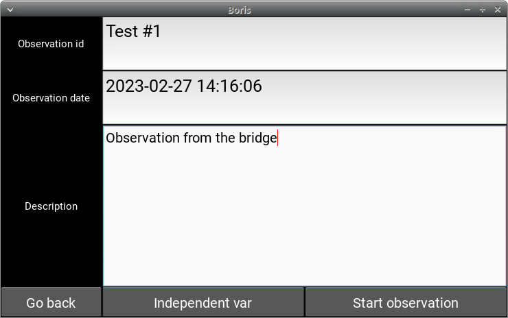
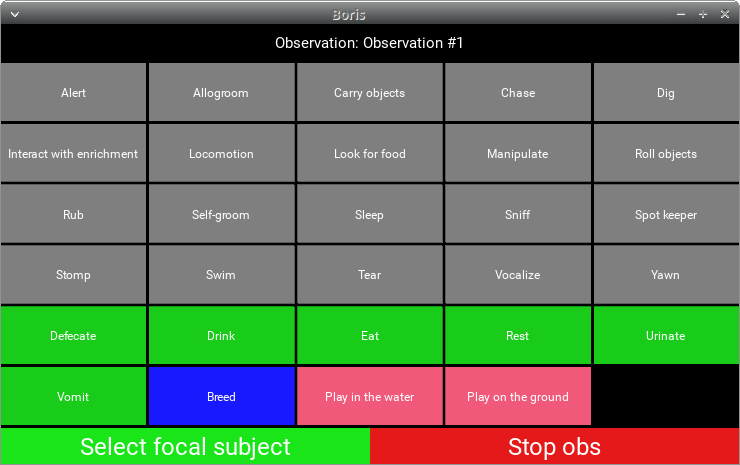
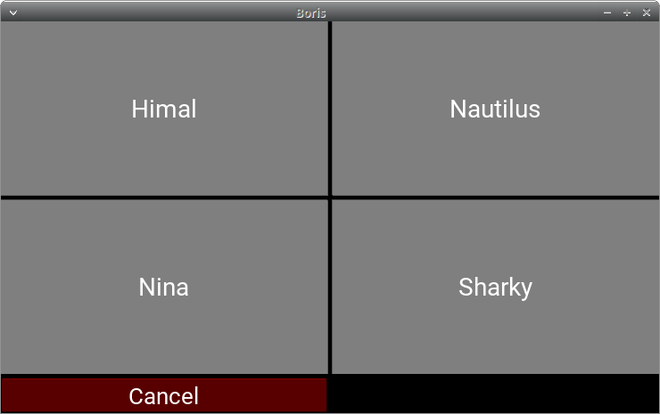
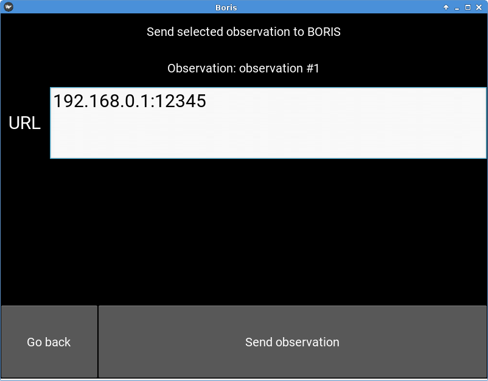

====================
BORIS App user guide
====================

:Author: `Olivier Friard <http://www.di.unito.it/~friard>`_

.. image:: logo_boris_500px.png
   :scale: 300%

**version 0.2.0**

**Be careful! This version must be considered as an ALPHA version only for testing**

.. contents::
    :backlinks: none

Legal
=====

Copyright 2017 Olivier Friard - Marco Gamba

**BORIS App** is free software; you can redistribute it and/or modify
it under the terms of the GNU General Public License as published by
the Free Software Foundation; either version 2, or any later version.

**BORIS App** is distributed in the hope that it will be useful,
but WITHOUT ANY WARRANTY; without even the implied warranty of
MERCHANTABILITY or FITNESS FOR A PARTICULAR PURPOSE.  See the
`GNU General Public License <http://www.gnu.org/copyleft/gpl.html>`_ for more details.

Introduction
============

**BORIS App** is an event logging app for live observations.

**BORIS App** is designed to be used with **BORIS** (Behavioral Observation Research Interactive Software, v. 4+) and share with it the project format.

**BORIS App** run on Android (2.2+). You will have to install the `Kivy Launcher <https://play.google.com/store/apps/details?id=org.kivy.pygame&hl=en>`_

Installation
============

Install the Kivy Launcher
-------------------------

BORIS App is developped in Python using `Kivy <https://kivy.org>`_ as user interface.
You must install the Kivy Launcher on your Android device before installing BORIS App.

https://play.google.com/store/apps/details?id=org.kivy.pygame&hl=en

You can run Kivy applications on Android, on any device with Android 2.2 +.

Install BORIS App on your Android device
----------------------------------------

The BORIS App is available on the BORIS web site: `www.boris.unito.it <http://www.boris.unito.it>`_

Extract the ZIP archive on your computer and the extracted directory (boris_app) to /sdcard/kivy/.

/sdcard/kivy/boris_app

Use
===

Launch the BORIS App
---------------------

* Start **Kivy Launcher**

.. image:: kivy_launcher.png
   :scale: 50%

* Select BORIS App, you should see the following screen:

.. image:: home.png
   :scale: 50%

* Press the **Download project** button

.. image:: download_screen.png
   :scale: 50%

Transfer your project from BORIS to BORIS App
---------------------------------------------

* Launch **BORIS** on your desktop or laptop computer (see www.boris.unito.it)

The BORIS user guide is available at `boris.readthedocs.io <http://boris.readthedocs.io>`_

* Open the project containing the ethogram you want to transfer to BORIS App

* Start the project server (File > Project server)

* On BORIS App check the "Download from BORIS" checkbox (default)

* Input the URL shown in BORIS on Desktop/Laptop computer (for example 192.168.1.2:33149) without spaces

* Press the **Download project** button

You should receive the project from BORIS Desktop and obtain the following message:

.. image:: download_successfull.png
   :scale: 50%

The BORIS desktop should show you this message:

Open the project
-----------------

* Press the **Open project** button

* Select the new downloaded project

* Press the **Open project** button

4) Start a new observation

* Press the **New observation** button

* Input an **Observation Id** (mandatory, this id must be unique in your project)

* Change the date (optional, default: current date time)

* Input a description for your observation (optional)

* If independent variables are defined, click on the **Independent var** button
and fill the value for each variable.

* Press the **Start observation** button

You will obtain a screen with buttons corresponding to behaviors defined in your project.
You can press it to code behaviors. The event time will be recorded in your observation.

If behavioral categories are defined in your project, the behaviors will be grouped by category and
buttons will be colored.

Select the focal subject
-------------------------

* Press the **Select focal subject** button

* Select the focal subject. If the focal subject is already selected, the subject will be deselected.

The focal subject will be show in the green button (at left bottom).

.. image:: running_observation_selected_subject.png
   :scale: 50%

6) State events

If you press on a state event, the corresponding behavior button will be highlighted in red until you press it again
to stop the state event.

Modifiers
------------

If modifiers are defined for the triggered behavior, BORIS App will show the modifiers page.

They are 3 type of modifiers:

* Single item selection from a list

* Multiple items selection from a list

* Numerical

BORIS App will show you the various

Stop the observation
---------------------

* Press the **Stop observation** red button. Confirm that you want to quit.

The observation will be saved in the current project.

8) Sending observation to BORIS desktop

You can send an observation back to BORIS desktop

* Start the project Server on BORIS desktop (**File > Porject server**)

* On BORIS App, open the project containing the observation to send.

* Press the **Send observation** button

* Select the observation you want to send in the observations' list

* Input the URL of project server

* Press the **Send observation** button

The observation will be added to the current project of BORIS desktop. If an observation with same id already exists
BORIS will ask you for renaming it or overwriting it.

Limitations
===========

These limitations will be fixed in next releases.

* At the moment BORIS App can handle only **one** set of modifiers

* BORIS App can not handle independent variables defined as **set of values**

